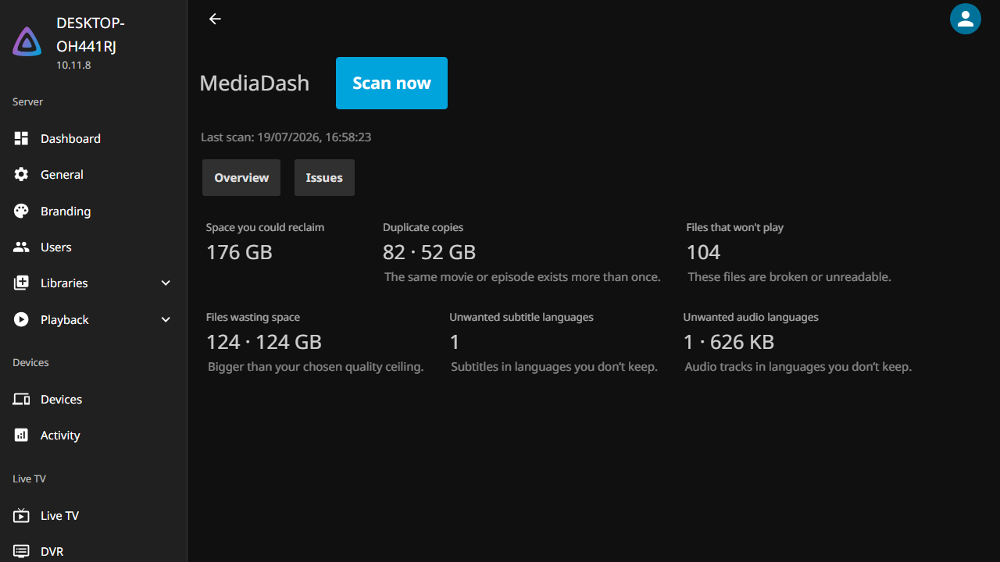
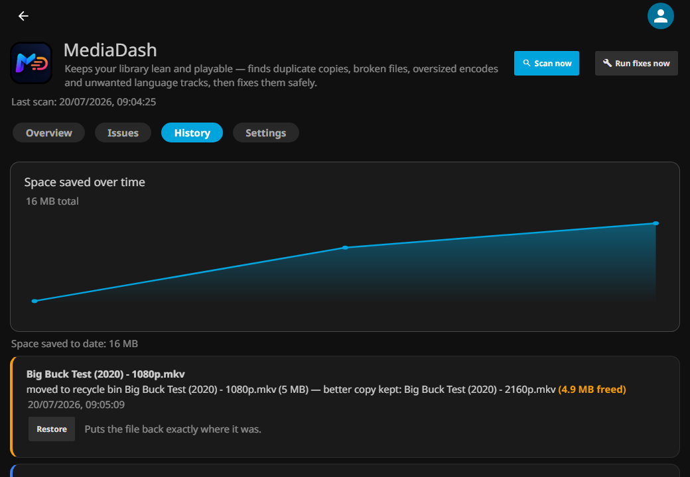
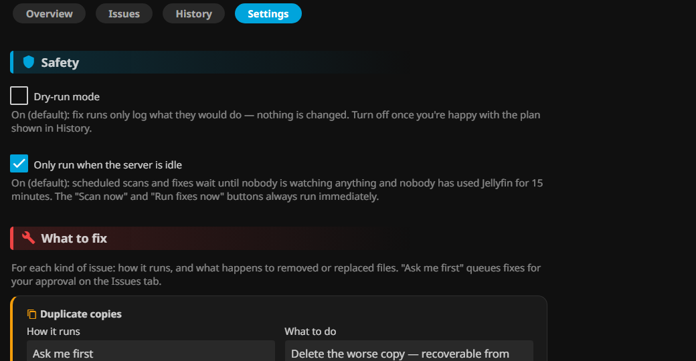

<p align="center"></p>

# MediaDash — keep your Jellyfin library lean and playable

MediaDash scans your libraries for **duplicate copies**, **files that won't play**, **oversized encodes**, and **audio/subtitle tracks in languages you don't want** — then fixes them, either automatically or after your approval. All from a dashboard inside the Jellyfin web UI.



## What it will and won't touch (read this first)

- **Dry-run is ON by default.** Fix runs only log what they *would* do until you turn it off in Settings.
- MediaDash **never touches files outside your configured library folders**.
- It **never removes a file's only audio track** or its video stream, whatever the language settings say.
- A re-encoded or rebuilt file **replaces the original only after it passes verification** (readable, same duration, expected streams).
- Removed files go to MediaDash's **recycle bin** (default 30 days, one-click restore) unless you explicitly choose permanent delete.
- Fix runs **pause while anyone is watching** something (default on).

## Features

| Scanner | What it finds | Fix |
|---|---|---|
| Duplicate copies | Same movie/episode more than once (by TMDb/IMDb/TVDb id, falling back to name+year) | Deletes the lower-quality copy; keeper policy configurable |
| Files that won't play | Broken, unreadable, zero-duration files; optional deep decode check | Flagged for your review — never auto-deleted |
| Files wasting space | Above your resolution/bitrate ceiling | Re-encode to your chosen codec + container (source file types filterable) |
| Unwanted audio languages | Extra audio tracks outside your language list | Lossless remux dropping those tracks |
| Unwanted subtitle languages | Embedded tracks and external files | Lossless remux / file removal |

Each fix type independently: **Off / Detect only / Ask me first / Automatic**, and **recycle bin / permanent delete**.



## Install

1. In Jellyfin: **Dashboard → Plugins → Repositories → +** and add this repository URL:
   `https://raw.githubusercontent.com/crackruckles/MediaDash/main/manifest.json` *(will be live with the first release)*
2. Go to **Catalog**, install **MediaDash**, restart Jellyfin.
3. Open **Dashboard → My Plugins → MediaDash** and answer the three setup questions.

Requires Jellyfin **10.11** or newer.

## First run

Setup asks three things: the language you keep, your quality ceiling, and whether fixes should wait for your approval. Everything else gets safe defaults. Run a scan, review the Issues tab, and check History to see what a fix run *would* do while dry-run is on.



## FAQ

**Will it delete something I can't get back?**
Not unless you choose both permanent delete *and* turn off dry-run. Out of the box, everything removed sits in the recycle bin for 30 days with a Restore button.

**Why isn't a broken file fixed automatically?**
Broken files can't be repaired by re-encoding — MediaDash flags them so you can replace or delete them deliberately.

**Does it use my GPU for re-encoding?**
v1 uses software encoding (libx265/libx264/SVT-AV1). Hardware encoder support is planned.

**A track has no language tag — will it be removed?**
No. Untagged (`und`) tracks are always kept, because deleting a track whose language is unknown isn't safe.

**Where's the scan schedule?**
Dashboard → Scheduled Tasks: "Scan libraries for issues" and "Apply approved fixes" — change their triggers like any other Jellyfin task.

## Development

```
dotnet build Jellyfin.Plugin.MediaDash.sln
dotnet test
```

Deploy locally: copy `Jellyfin.Plugin.MediaDash/bin/Debug/net9.0/Jellyfin.Plugin.MediaDash.dll` to your server's `plugins/MediaDash/` folder and restart. Test fixtures: `tools/make-fixtures.sh <dir>`; full docker cycle: `tools/integration-test.sh`.

## License

GPLv3 — see [LICENSE](LICENSE).
