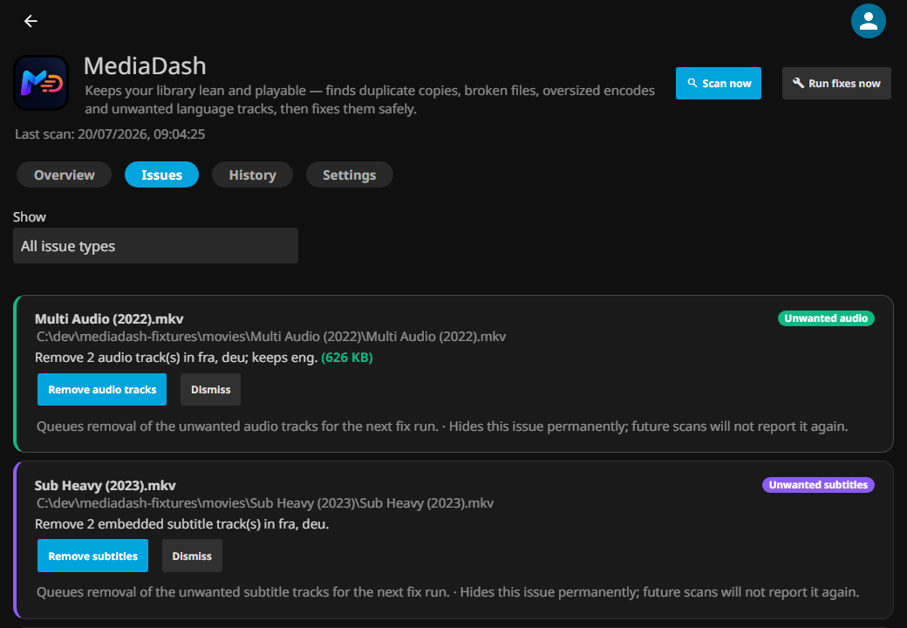

<div align="center">


# MediaDash

**The one plugin a Jellyfin library owner needs.**

Duplicates, broken files, oversized encodes, wrong-language tracks, misplaced files, missing subtitles — surfaced on one dashboard and fixed safely on your schedule.

[](https://github.com/crackruckles/MediaDash/actions/workflows/ci.yaml)
[](https://github.com/crackruckles/MediaDash/releases/latest)
[](https://jellyfin.org)
[](LICENSE)


</div>

---

> [!NOTE]
> MediaDash is a **third-party plugin**, not officially affiliated with the Jellyfin project. It's not yet in the official Jellyfin plugin catalog — install from the community repository URL below.

## Install (30 seconds)

1. In Jellyfin: **Dashboard → Plugins → Repositories → +** and paste:

   ```
   https://raw.githubusercontent.com/crackruckles/MediaDash/main/manifest.json
   ```

2. Open **Catalog**, find **MediaDash**, click **Install**, restart Jellyfin.
3. Open **Dashboard → My Plugins → MediaDash** — the first-run wizard walks you through each feature, one step at a time.

Requires Jellyfin **10.11+**.

## What it does

| | Finds | Fixes |
|---|---|---|
| 🗂 **Duplicate copies** | Same movie/episode twice (by TMDb/IMDb/TVDb id, or name + year) | Deletes the worse copy — you choose what "worse" means |
| 🚫 **Files that won't play** | Broken / unreadable files — every file is *test-played* at its start, middle and end | Removes them, after re-checking they're really broken |
| 📦 **Files wasting space** | Anything above your resolution / bitrate ceiling | Re-encodes to your chosen codec + container (GPU-accelerated, per-GPU selectable) |
| 💬 **Unwanted subtitles** | Embedded tracks + external files in languages you don't keep | Lossless remux — no quality loss |
| 🔊 **Unwanted audio** | Extra audio tracks outside your language list | Lossless remux — never touches a file's only audio track |
| 📥 **Missing subtitles** | Videos with no subtitle in any language you keep | Downloads via Jellyfin's configured providers (OpenSubtitles etc.) |
| 🚚 **Misplaced files** | A movie under TV or a TV episode under Movies | Moves it into the right library folder |

Every fix type runs independently: **Off · Detect only · Ask me first · Automatic**.

<div align="center">

</div>

## Built to be trusted with your media

- 🛡 **Dry-run is on by default** — fix runs only log what they *would* do until you say otherwise
- ♻️ **Recycle bin, not deletion** — removed files are recoverable for 30 days with one-click Restore
- ✅ **Verify before swap** — a re-encoded file replaces the original only after it passes probe verification (duration, streams)
- 🔒 **Hard limits** — never touches files outside your libraries, never removes a file's last audio track, never moves a file outside a library root, checks free disk space before encoding
- 😴 **Polite** — scheduled runs wait until nobody is watching and the server has been idle for 15 minutes

<div align="center">

</div>

## Highlights

- **Feature-at-a-time first-run wizard** — walks each scanner and its settings one step at a time; every knob is also on the Settings tab, and the wizard is re-openable from Settings → Maintenance.
- **Live system stats on Overview** — CPU / RAM / per-GPU utilisation, Windows and Linux, with an AMD APU `gpu_metrics` fallback for Rembrandt / Phoenix iGPUs where the plain busy-percent counter is broken.
- **Hardware-accelerated re-encoding** — uses the AMF / NVENC / QSV / VideoToolbox encoder Jellyfin already knows about, with a preferred-GPU picker and automatic per-file software fallback.
- **Subtitle downloading via your Jellyfin providers** — MediaDash surfaces missing subs; the download itself uses whatever provider you already configured in Jellyfin (no new API keys to manage).
- **Smart test-play cache** — thorough playability checks only re-run on files that changed.
- **Files tab** — scoped file browser inside your library folders (rename / move / delete, admin only, deletes go to the recycle bin).
- **Scan & fix schedules live in Jellyfin's own Scheduled Tasks dashboard.**

<div align="center">

</div>

## FAQ

**Will it delete something I can't get back?**
Not unless you choose both permanent delete *and* turn off dry-run. Out of the box everything removed sits in the recycle bin for 30 days.

**Why isn't a broken file fixed automatically?**
Broken files can't be repaired — MediaDash flags them so *you* decide. Even in full-automatic mode, removing broken files always waits for your approval.

**A track has no language tag — will it be removed?**
Never. Untagged tracks are always kept, because deleting a track whose language is unknown isn't safe.

**How does MediaDash download subtitles?**
It uses Jellyfin's own subtitle providers — the ones you'd configure at Dashboard → Metadata → Subtitles. If you haven't set any up, missing-subs fixes fail with a specific message telling you why. No new keys, no new provider — same OpenSubtitles / etc. account you already have.

**Does re-encoding lose my subtitles?**
Not with the default MKV output. MP4 output skips subtitle tracks (the format's support is too patchy) — the setting says so.

**Does the plugin download or acquire media?**
No. MediaDash is explicitly *not* an arr-style acquisition tool. It cleans, verifies and completes the library you already have. See [PLAN.md](PLAN.md) for the deliberate scope.

## Development

See [CONTRIBUTING.md](CONTRIBUTING.md) for build steps, style, safety invariants, and the release process. Code of conduct: [Contributor Covenant](CODE_OF_CONDUCT.md).

## Reporting a bug

Errors tab → **Copy diagnostics** → paste into a new [GitHub issue](https://github.com/crackruckles/MediaDash/issues/new). The dump includes plugin/Jellyfin/OS/runtime versions and every recorded error.

## License

[GPLv3](LICENSE) — required because Jellyfin's shared libraries are GPLv3, and a plugin compiled against them inherits that licence.
